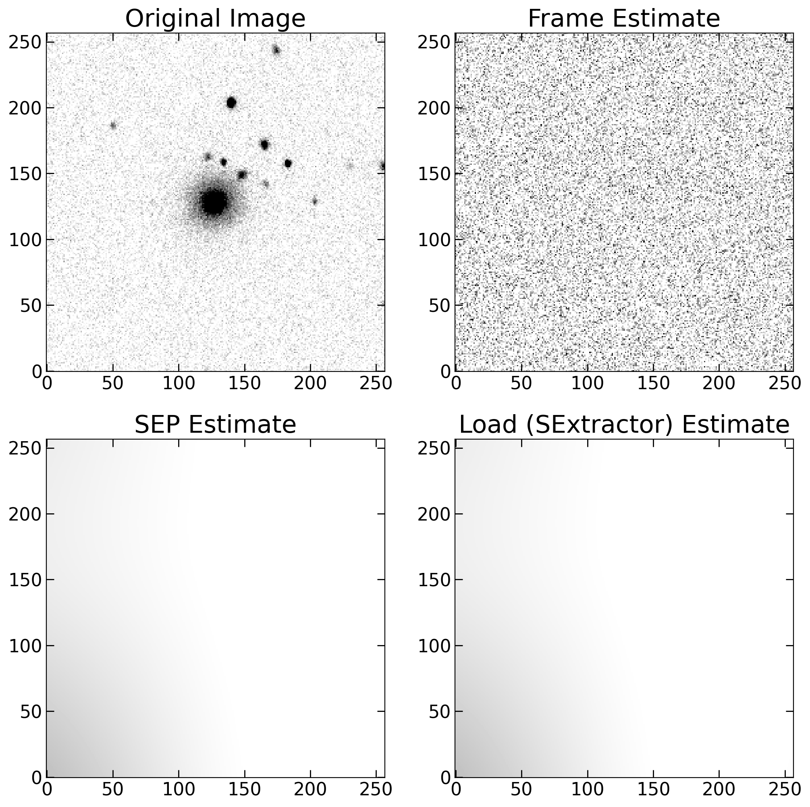

Background Subtraction
======================

Start BackgroundEstimator class
-------------------------------

This function receives only an identifier (galaxy_name) and the galaxy image. All the function built in this class returns 4 objects, respectively: median and standard deviation of the background, the bkg_image, and the image after subtracting the background estimated.

.. code-block:: python

   from mex.Background_module import BackgroundEstimator
   galaxy_name = '588848901526257813'
   bkg_estimator = BackgroundEstimator(galaxy_name, galaxy_image)
           

Flat background
---------------
In this option, you can provide the especific value and standard deviation to subtract from the galaxy image. For instance, in the case of SDSS the background is somewhat flat, with median value ~1100 counts, and standard deviation ~6.

.. code-block:: python

   bkg_median_flat, bkg_std_flat, bkg_image_flat, galaxy_nobkg_flat = bkg_estimator.flat_background(value = 1100, std = 6)

Frame background
----------------
This option sets a frame around image edges to select pixels and perform a statistic analysis of the background. The image_fraction variable defines the percentage relative to the image size to use as frame. By setting sigma_clipping = True, it is also possible to perform a sigma clipping to avoid contamination from secondary objects within the frame selected pixels. The clipping_threshold variable defines the threshold to discard pixels. For example, clipping_threshold = 3 (with sigma_clipping = True) will discard pixels above median+3sigma before computing background median and standard deviation in selected pixels.

.. code-block:: python

   bkg_median_frame, bkg_std_frame, bkg_image_frame, galaxy_nobkg_frame = bkg_estimator.frame_background(image_fraction = 0.1, sigma_clipping = True, clipping_threshold = 3)

Source Extractor in Python (SEP)
--------------------------------
The SEP package provides a similar implementation of the famous Source EXtractor (SExtractor) code in python. This method is simply a wrapper of the sep.background function. Besides the usual bw, bh, fw and fh, this function can receive additional keywords, as described in https://sep.readthedocs.io/en/v1.0.x/api/sep.Background.html.

.. code-block:: python

   bkg_median_sep, bkg_std_sep, bkg_image_sep, galaxy_nobkg_sep = bkg_estimator.sep_background(bw = 100, bh = 100, fw = 3, fh = 3)

Load from file
--------------
If you already have the background fits image (from a SExtractor run, for instance), it is possible to use it as input providing the right path and file names. Just to exemplify all possible uses, I define below some dummy variables. If bkg_file is not provided, it assumes that the bkg file name follow the structure: {bkg_image_prefix}galaxy_name{bkg_image_sufix}.fits. Note that I also assume that it is a fits image.

.. code-block:: python

   bkg_file = "background.fits"
   bkg_image_path = "./"
   bkg_image_prefix = ""
   bkg_image_sufix = ""
   bkg_image_HDU = 0
   bkg_median_load, bkg_std_load, bkg_image_load, galaxy_nobkg_load = bkg_estimator.load_background(bkg_file, bkg_image_path, bkg_image_prefix, bkg_image_sufix, bkg_image_HDU)

Plot comparisons
----------------

For obvious reasos, I will not include the plot for the flat estimate.

.. code-block:: python

   plt.figure(figsize = (12,12), dpi = 200)
   
   
   plt.subplot(2,2,1)
   plt.title("Original Image", fontsize = 22)
   m, s = np.nanmedian(galaxy_image), np.nanstd(galaxy_image)
   plt.imshow(galaxy_image, origin = 'lower', vmin = m, vmax = m+(3*s), cmap = 'gray_r')
   plt.xticks(fontsize = 16)
   plt.yticks(fontsize = 16)
   plt.tick_params(direction = 'in', size = 7, left = True, right = True, bottom = True, top = True, 
                   color = 'k', width = 1)
   
   plt.subplot(2,2,2)
   plt.title("Frame Estimate", fontsize = 22)
   m,  s = np.nanmedian(bkg_image_frame), np.nanstd(bkg_image_frame)
   plt.imshow(bkg_image_frame, origin = 'lower', cmap = 'gray_r', vmin = m, vmax = m+(3*s))
   plt.tick_params(direction = 'in', size = 7, left = True, right = True, bottom = True, top = True, 
                   color = 'k', width = 1)
   plt.xticks(fontsize = 16)
   plt.yticks(fontsize = 16)
   
   plt.subplot(2,2,3)
   plt.title("SEP Estimate", fontsize = 22)
   m,  s = np.nanmedian(bkg_image_sep), np.nanstd(bkg_image_sep)
   plt.imshow(bkg_image_sep, origin = 'lower', cmap = 'gray_r', vmin = m, vmax = m+(3*s))
   plt.tick_params(direction = 'in', size = 7, left = True, right = True, bottom = True, top = True, 
                   color = 'k', width = 1)
   plt.xticks(fontsize = 16)
   plt.yticks(fontsize = 16);
   
   plt.subplot(2,2,4)
   plt.title("Load (SExtractor) Estimate", fontsize = 22)
   m,  s = np.nanmedian(bkg_image_load), np.nanstd(bkg_image_load)
   plt.imshow(bkg_image_load, origin = 'lower', cmap = 'gray_r', vmin = m, vmax = m+(3*s))
   plt.xticks(fontsize = 16)
   plt.yticks(fontsize = 16)
   plt.tick_params(direction = 'in', size = 7, left = True, right = True, bottom = True, top = True, 
                    color = 'k', width = 1)

   Comparison of background subtraction methods: flat, frame-based, and SEP.

