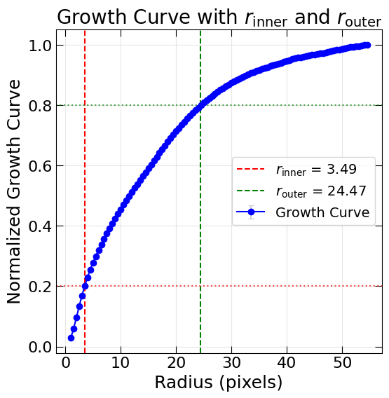

CAS Metrics
===========

The **CAS system** — standing for **Concentration (C)**, **Asymmetry (A)**, and **Smoothness (S)** — is one of the most widely used non-parametric methods to quantify galaxy morphology. Originally proposed by Conselice (2003), it offers a straightforward way to relate the structural appearance of galaxies to their formation and evolutionary stages.

This section describes how the `galmex` package implements these three indices, offering flexibility to reproduce canonical definitions as well as to test alternative variants.

Each metric is implemented as a dedicated Python class:

- :class:`galmex.Metrics_module.Concentration`  
  Computes the concentration index based on radial light profiles using elliptical or circular apertures.

- :class:`galmex.Metrics_module.Asymmetry`  
  Estimates the rotational asymmetry of a galaxy, following Conselice (2003) and additional formulations such as Sampaio and Barchi et al.

- :class:`galmex.Metrics_module.Smoothness`  
  Measures the small-scale structures in galaxies by comparing the original image with a smoothed version, optionally corrected for noise.

All three classes follow a similar pattern: they are initialized with the necessary data (typically the image and optional segmentation or noise arrays), and expose functions to compute the respective metrics with different parameterizations.

In the subsections below, we provide examples of how to use each class, following both the original prescriptions and recent adaptations. This includes:

- Parameter descriptions
- Output structure and interpretation
- Code examples with recommended defaults
- Optional visualization tools (e.g., growth curves, asymmetry fields, and smoothness comparisons)

If your goal is to reproduce exactly the CAS system as defined in Conselice (2003), please refer to the dedicated tutorial entry:  
**:doc:`../tutorial/tutorial_index`**

Concentration
-------------

Concentration is one of the metrics in the CAS system. It quantifies how light is distributed toward the center of a galaxy and has a well-established connection with the Sérsic index. MEx implements concentration as a class-based tool, requiring only a galaxy image as the base input.

.. code-block:: python

    from galmex.Metrics_module import Concentration

    conc = Concentration(galaxy_clean_iso)

Following Conselice (2003)
~~~~~~~~~~~~~~~~~~~~~~~~~~

The C parameter as defined by Conselice is:

.. math::

    C = 5 \times \log_{10}\left(\frac{R_{80}}{R_{20}}\right)

Where :math:`R_{80}` and :math:`R_{20}` are the radii that enclose 80% and 20% of the galaxy's total light.

To compute this, use the `get_concentration()` method, which takes:

- Galaxy center `(x, y)`
- Best-fit ellipse axes `(a, b)` and orientation `theta`
- Method name (`'conselice'` or `'barchi'`)
- Sampling and interpolation controls

.. code-block:: python

    C, rinner, routter = conc.get_concentration(
        x = x, y = y, a = a, b = b, theta = theta,
        method = 'conselice', 
        f_inner = 0.2, f_outter = 0.8,
        rmax = 2*rp, sampling_step = 0.5,
        Naround = 3, interp_order = 3
    )

Following Barchi et al. (2020)
~~~~~~~~~~~~~~~~~~~~~~~~~~~~~~

Barchi et al. define concentration with a simplified logarithmic ratio:

.. math::

    C = \log_{10}\left(\frac{R_{80}}{R_{20}}\right)

To compute it:

.. code-block:: python

    C, rinner, routter = conc.get_concentration(
        x = x, y = y, a = a, b = b, theta = theta,
        method = 'barchi', 
        f_inner = 0.2, f_outter = 0.8,
        rmax = 2*rp, sampling_step = 0.5,
        Naround = 3, interp_order = 3
    )
    
    
Calculate the Growth Curve
~~~~~~~~~~~~~~~~~~~~~~~~~~

The Concentration class also provides access to the cumulative light profile of a galaxy, which is useful for testing, debugging, or calculating alternative flux-based radii. The method `get_growth_curve()` returns the cumulative light curve (also called growth curve), the corresponding sampling radii, and the associated uncertainties.

It requires the galaxy center coordinates `(x, y)` and ellipse parameters `(a, b, theta)`.

.. code-block:: python

    radii, growth_curve, growth_err = conc.get_growth_curve(x, y, a, b, theta)
    
Radius Containing a Fraction of Total Flux
~~~~~~~~~~~~~~~~~~~~~~~~~~~~~~~~~~~~~~~~~~

Based on the growth curve and radius values returned above, the `get_radius()` function allows you to compute the radius enclosing an arbitrary fraction of the total flux (e.g., 0.5 = half-light radius).

This method uses spline interpolation to estimate the radius that matches the desired cumulative flux level.

.. code-block:: python

    r_half = conc.get_radius(radii, growth_curve, fraction=0.5)    

Plot Growth Curve
~~~~~~~~~~~~~~~~~

You can generate a visual check of the light profile to validate the radii and integration results. This plots the cumulative flux as a function of radius and marks :math:`R_{20}` and :math:`R_{80}`.

.. code-block:: python

    conc.plot_growth_curve(
        x = x, y = y, a = a, b = b, theta = theta, 
        rmax = 2*rp, f_inner = 0.2, f_outter = 0.8, 
        Naround = 3, interp_order = 3,
        sampling_step = 0.1,
        title = "Example: Concentration Sanity Check"
    )

   Growth curve.
   
   
Asymmetry
---------

Asymmetry is one of the most commonly used non-parametric morphological indices in the literature, particularly for identifying merger candidates. It quantifies the difference between a galaxy and its rotated counterpart (typically by 180°). The `galmex` package implements asymmetry via a dedicated class, `Asymmetry`, which supports various definitions including Conselice (2003), Sampaio (in prep), and Barchi et al. (2020).

To instantiate the class:

.. code-block:: python

    from galmex.Metrics_module import Asymmetry

    asymmetry_calculator = Asymmetry(
        clean_mini,
        angle=180,
        segmentation=segmented_mini,
        noise=noise_mini
    )

Note: all inputs must have the same dimensions. The noise map is optional, but if omitted, the asymmetry will not be corrected for noise.

Conselice's Asymmetry
~~~~~~~~~~~~~~~~~~~~~

The original implementation by Conselice (2000, 2003) offers two versions:

- **RMS-based**:
  
  .. math::
     A^{2}_\mathrm{RMS} = \frac{\sum (I_0 - I_R)^2}{2 \sum I_0^2}

- **ABS-based**:
  
  .. math::
     A_\mathrm{ABS} = \frac{\sum |I_0 - I_R|}{2 \sum |I_0|}

The code uses a 3×3 grid around the image center to iteratively minimize asymmetry. If a noise map is provided, it is also minimized and subtracted. The final asymmetry is:

.. math::
   A_\mathrm{final} = \min(A_\mathrm{Galaxy}) - \min(A_\mathrm{Noise})

Additionally, the method allows control over the pixel comparison logic (`"equal"` for AND, `"simple"` for OR).

.. code-block:: python

    A_final, A_gal, A_noise, center_gal, center_noise, niter_gal, niter_noise = \
        asymmetry_calculator.get_conselice_asymmetry(
            method='absolute',
            pixel_comparison='simple',
            max_iter=50
        )

Barchi's Asymmetry
~~~~~~~~~~~~~~~~~~

As defined by Ferrari et al. (2015) and Barchi et al. (2020), this version is based on correlation:

.. math::
   A = 1 - r

Where :math:`r` is the Pearson or Spearman correlation between original and rotated pixels. It does not include a noise term.

.. code-block:: python

    A_barchi, r_max, center, niter = \
        asymmetry_calculator.get_barchi_asymmetry(
            corr_type='spearman',
            pixel_comparison='equal',
            max_iter=50
        )

Sampaio's Asymmetry
~~~~~~~~~~~~~~~~~~~

This version is an alternative approach under development (Sampaio, in prep), intended to improve noise normalization. Instead of summing pixel values, it uses a per-pixel relative difference and is normalized by the number of valid pixels.

.. math::
   A = \frac{1}{2N} \sum \left| \frac{I_0 - I_R}{I_0} \right|

It includes noise correction using the same formulation, and the final value is given by:

.. math::
   A_\mathrm{final} = \min(A_\mathrm{Galaxy}) - \min(A_\mathrm{Noise})

.. code-block:: python

    A_final, A_gal, A_noise, center_gal, center_noise, niter_gal, niter_noise = \
        asymmetry_calculator.get_sampaio_asymmetry(
            method='absolute',
            pixel_comparison='equal',
            max_iter=50
        )

Smoothness
----------

Smoothness (or Clumpiness) quantifies small-scale structures in a galaxy's light profile, serving as a proxy for recent star formation or structural irregularity. In the `mex` package, the `Smoothness` class supports three definitions: Conselice (2003), Barchi et al. (2020), and Sampaio (in prep).

To initialize the class, provide the cleaned image, segmentation mask, an optional noise image, and a smoothing kernel type and scale:

.. code-block:: python

    from galmex.Metrics_module import Smoothness

    smoothness_calculator = Smoothness(
        clean_mini,
        segmentation=segmented_mini,
        noise=noise_mini,
        smoothing_factor=rp/5,
        smoothing_filter="box"
    )

Conselice's Smoothness
~~~~~~~~~~~~~~~~~~~~~~

The original definition from Conselice (2003) uses a residual image, computed by subtracting a smoothed version of the galaxy from the original. The difference is normalized by the total galaxy flux and multiplied by 10:

.. math::
   S = 10 \cdot \sum \frac{ (I - I_S)}{I}

Only positive residuals are considered, and a noise correction is applied if available.

.. code-block:: python

    S_final = smoothness_calculator.get_smoothness_conselice()

Barchi's Smoothness
~~~~~~~~~~~~~~~~~~~

Barchi et al. (2020) define smoothness as the lack of correlation between the original and smoothed images. The value is computed as:

.. math::
   S = 1 - \rho

Where :math:`\rho` is the Spearman or Pearson correlation coefficient.

.. code-block:: python

    S_final, r = smoothness_calculator.get_smoothness_barchi(method = "spearman")

Sampaio's Smoothness
~~~~~~~~~~~~~~~~~~~~

This definition normalizes the residuals per pixel and subtracts the noise contribution explicitly:

.. math::
   S = \frac{1}{2N_p} \sum \left| \frac{I - I_S}{I} \right| - \frac{1}{2N_p} \sum \left| \frac{N - N_S}{I} \right|,
   
where Np is the number of pixels considered.

.. code-block:: python

    S_final, S_gal, S_noise = smoothness_calculator.get_smoothness_sampaio()

