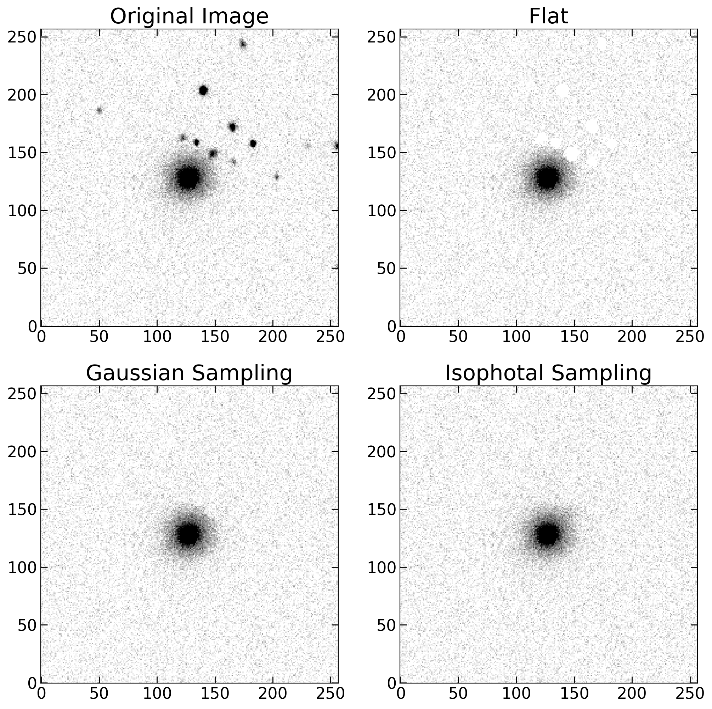

Image Cleaning
==============

Secondary objects such as foreground stars, background galaxies, or bright artifacts can significantly affect non-parametric morphological indices. To address this, MEx provides a dedicated `GalaxyCleaner` class, which offers multiple strategies to remove or neutralize unwanted objects from the galaxy cutout.

Start GalaxyCleaner class
--------------------------

This class receives the galaxy image and its corresponding segmentation map. Upon initialization, the label at the image center is assumed to be the main galaxy. All other detected objects (label ≠ 0 and ≠ main galaxy) are considered contaminants and can be removed using different strategies.

.. code-block:: python

   from galmex.Cleaning_module import GalaxyCleaner
   cleaner = GalaxyCleaner(galaxy_image, segmentation_map)

Flat filler
-----------

In this method, all pixels identified as belonging to secondary objects are simply replaced by a constant value. This value is typically the background median (e.g., 0 in a subtracted image). It's useful when you want to avoid introducing artificial signal in cleaned regions.

.. code-block:: python

   galaxy_clean_flat = cleaner.flat_filler(median = 0)

Gaussian filler
---------------

Instead of setting a constant, this method replaces secondary-object pixels with values sampled from a Gaussian distribution. This is useful to simulate background noise after subtraction. You can specify the mean and standard deviation (e.g., std ≈ background noise level).

.. code-block:: python

   galaxy_clean_gauss = cleaner.gaussian_filler(mean = 0, std = 7)

Isophotal filler
----------------

This advanced method performs an elliptical interpolation of the main galaxy light profile to fill in contaminated pixels. The image is scanned along elliptical annuli oriented by a given angle, and missing pixels are filled based on nearby values along the same isophote.

.. code-block:: python

   theta = np.pi / 6  # Galaxy orientation in radians
   galaxy_clean_iso = cleaner.isophotes_filler(theta = theta)

Plot comparisons
----------------

Here is an example plot showing the three cleaning methods compared side by side:

.. code-block:: python

   plt.figure(figsize = (12, 12), dpi = 200)

   plt.subplot(2, 2, 1)
   plt.title("Original Image", fontsize = 22)
   plt.imshow(galaxy_image, origin='lower', cmap='gray_r')
   plt.axis('off')

   plt.subplot(2, 2, 2)
   plt.title("Flat Filling", fontsize = 22)
   plt.imshow(galaxy_clean_flat, origin='lower', cmap='gray_r')
   plt.axis('off')

   plt.subplot(2, 2, 3)
   plt.title("Gaussian Filling", fontsize = 22)
   plt.imshow(galaxy_clean_gauss, origin='lower', cmap='gray_r')
   plt.axis('off')

   plt.subplot(2, 2, 4)
   plt.title("Isophotal Interpolation", fontsize = 22)
   plt.imshow(galaxy_clean_iso, origin='lower', cmap='gray_r')
   plt.axis('off')

   Comparison between different image cleaning methods: flat, Gaussian-sampled, and elliptical isophotal interpolation.

