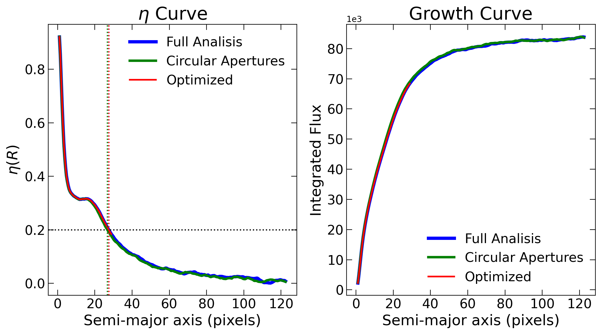

Light Profile Analysis
======================

Start PetrosianCalculator class
-------------------------------

When analysing galaxies, an important feature is the Petrosian radius, which provides a redshift-independent scale with respect to galaxy light profile. I included within the package a function to easily calculate the Petrosian radius, in pixels. Notably, the Petrosian radius is a more stable choice over other radii adopted in the literature, such as Kron radius, or the radius encomprising a fraction of total flux. Differently from the previous functions, where the input of the main class was simply the image and the segmentation mask, in this case the PetrosianCalculator class is initialized using the desired image (I suggest using a cleaned image) and the properties of the object within the image, i.e. the x and y coordinates (in pixels), semi-major and semi-minor axis (a and b), and the object inclination angle (theta, in radians).

.. code-block:: python

   from mex.Petrosian_module import PetrosianCalculator

   x, y, a, b, theta, npix = sep_catalog.iloc[main_id - 1][['x', 'y', 'a', 'b', 'theta', 'npix']]
   rp_calc = PetrosianCalculator(galaxy_clean_iso, x, y, a, b, theta)

Calculate Petrosian Radius - Optimized
--------------------------------------

Notably, the easiest way to define the Petrosian radius is to calculate using apertures until image edges. However, this becomes extremely slow when dealing with large images. To avoid this, I include in the function below the option to optimize this calculation. Namely, it uses the bissection method to define when it should stop.

.. code-block:: python

   eta, growth_curve, radius, rp, eta_flag = rp_calc.calculate_petrosian_radius(
       rp_thresh = 0.2,
       aperture = "elliptical",
       optimize_rp = True,
       interpolate_order = 3,
       Naround = 3,
       rp_step = 0.05
   )

Comparison between different setups
-----------------------------------

Below I show a comparison between the different setups. Since the selected object is very close to a circle, i.e. a/b~1, there is not much difference between Circular or Elliptical apertures.

.. code-block:: python

   plt.figure(figsize = (12,6), dpi = 200)

   plt.subplot(1,2,1)
   plt.title(r'$\eta$ Curve', fontsize = 22)
   plt.plot(radius2, eta2, color = 'b', lw = 4, label = 'Full Analisis')
   plt.plot(radius3, eta3, color = 'g', lw = 3, label = 'Circular Apertures')
   plt.plot(radius, eta, color = 'r', lw = 2, label = 'Optimized')
   plt.axhline(0.2, color = 'k', ls = ':')
   plt.axvline(rp2, color = 'b', ls = ':')
   plt.axvline(rp3, color = 'g', ls = ':')
   plt.axvline(rp, color = 'r', ls = ':')
   plt.xticks(fontsize = 16)
   plt.yticks(fontsize = 16)
   plt.xlabel("Semi-major axis (pixels)", fontsize = 18)
   plt.ylabel(r"$\eta(R)$", fontsize = 18)
   plt.legend(frameon = False, fontsize = 16)
   plt.tick_params(direction = 'in', size = 7, left = True, right = True, bottom = True, top = True)

   ax = plt.subplot(1,2,2)
   plt.title(r'Growth Curve', fontsize = 22)
   plt.plot(radius2, growth_curve2, color = 'b', lw = 4, label = 'Full Analisis')
   plt.plot(radius3, growth_curve3, color = 'g', lw = 3, label = 'Circular Apertures')
   plt.plot(radius, growth_curve, color = 'r', lw = 2, label = 'Optimized')
   plt.xticks(fontsize = 16)
   plt.yticks(fontsize = 16)
   plt.xlabel("Semi-major axis (pixels)", fontsize = 18)
   plt.ylabel("Integrated Flux", fontsize = 18)
   plt.legend(frameon = False, fontsize = 16)
   ax.ticklabel_format(axis = 'y', scilimits = (3,3))
   plt.tick_params(direction = 'in', size = 7, left = True, right = True, bottom = True, top = True)

   Comparison between different Petrosian radius setups: full analysis, circular aperture, and optimized.
