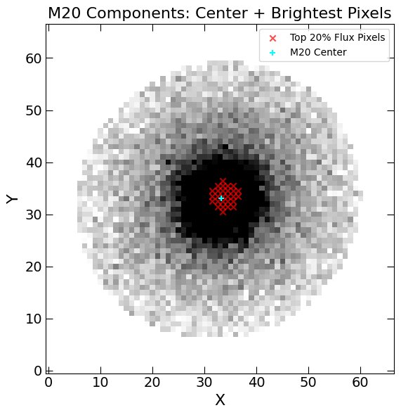
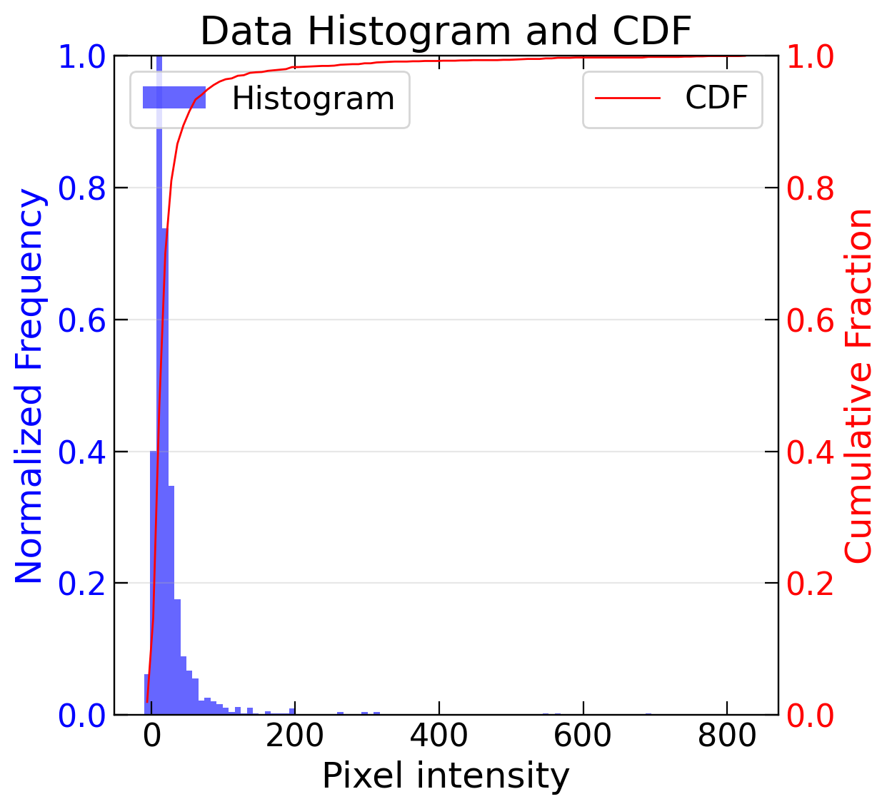
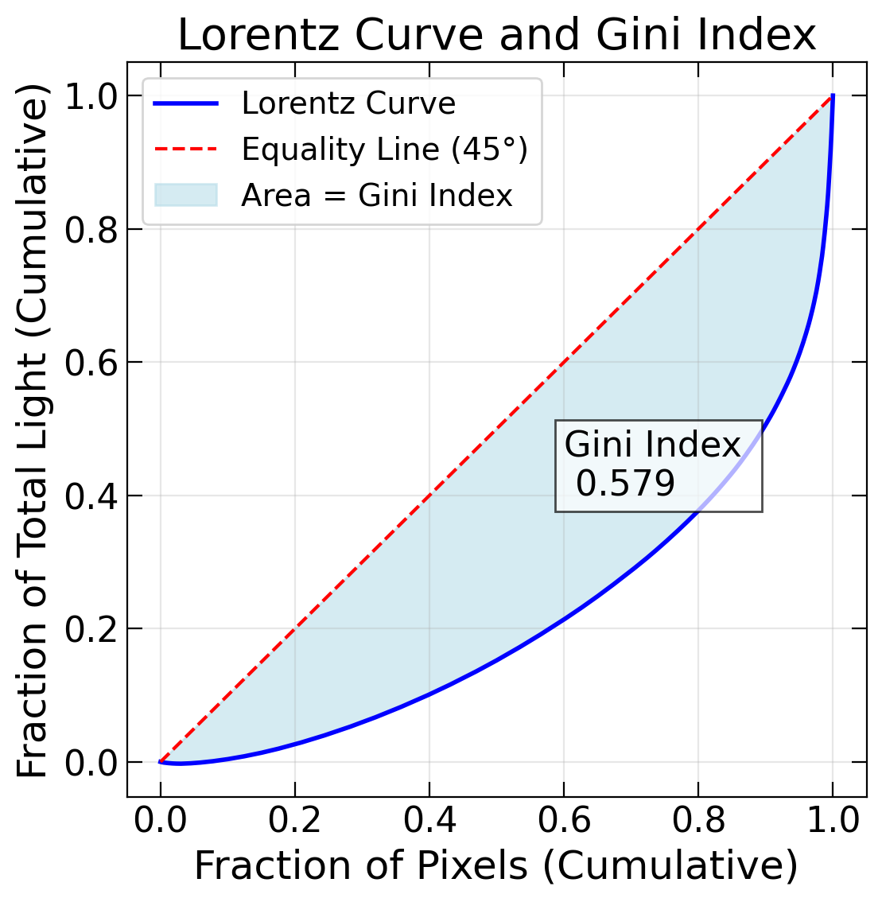
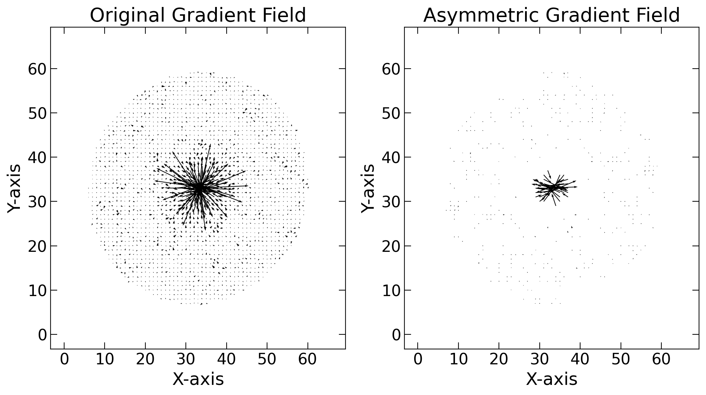
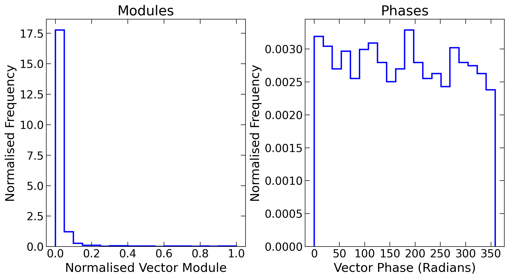

MEGG Metrics
============

The **MEGG** system — an acronym for **M20**, **Entropy**, **Gini**, and **G2** — is a collection of non-parametric morphological metrics designed to quantify **flux distribution**, **structural complexity**, and **asymmetry** in galaxies.

All MEGG metrics are computed using cleaned and recentered galaxy images, combined with a segmentation mask. Each metric is implemented as a dedicated Python class:

- :class:`mex.Metrics_module.Moment_of_light`  
  Calculates the **M20** index, the second-order moment of the brightest 20% of the galaxy light.

- :class:`mex.Metrics_module.Shannon_entropy`  
  Computes the **Shannon entropy**, quantifying the disorder or randomness in the pixel intensity distribution.

- :class:`mex.Metrics_module.Gini_index`  
  Measures the **inequality** of light distribution across galaxy pixels, with higher values indicating strong central concentrations or clumps.

- :class:`mex.Metrics_module.GPA`  
  Estimates the **G2 index**, a recent metric based on rotational asymmetry in gradient vector fields, designed to trace morphological disturbances (Kolesnikov et al. 2024).

These classes provide standardized methods for computing each index, along with optional plotting utilities and parameter controls. In the following sections, each metric is described in detail, with example use cases and code snippets.

Moment of Light (M20)
---------------------

The M20 parameter measures the spatial distribution of the brightest regions of a galaxy and is particularly sensitive to off-center star-forming clumps and merger signatures. It quantifies the normalized second-order moment of the brightest 20% of the total galaxy flux, as introduced in Lotz et al. (2004).

To use this metric in `mex`, initialize the `Moment_of_light` class with a cleaned image and binary segmentation mask:

.. code-block:: python

    from mex.Metrics_module import Moment_of_light

    moment_calculator = Moment_of_light(clean_mini, segmentation=segmented_mini)

Compute M20
~~~~~~~~~~~

The method :code:`get_m20` calculates the M20 index by summing the second-order moments of the brightest pixels that contribute to a specified fraction (typically 20%) of the total galaxy flux. The center used in the calculation can be fixed or optimized to minimize the total moment.

.. math::
   M_{20} = \log_{10} \left( \frac{\sum_i^f M_i}{\sum_i M_i} \right)

Where :math:`M_i = f_i \cdot [(x_i - x_c)^2 + (y_i - y_c)^2]` is the second-order moment of each pixel, and :math:`f` is the fraction (usually 0.2) of the brightest total flux.

.. code-block:: python

    m20, xc_m20, yc_m20 = moment_calculator.get_m20(f=0.2, minimize_total=True)

This returns the M20 value along with the coordinates of the center used in the calculation.

Plot contributing pixels
~~~~~~~~~~~~~~~~~~~~~~~~

The method :code:`plot_M20_contributors` displays the original galaxy image with an overlay of the pixels that contribute to the M20 calculation and the optimized center location.

.. code-block:: python

    moment_calculator.plot_M20_contributors(x0, y0, minimize_total=True)

This is a useful diagnostic tool to visually verify that the M20 computation is tracing the expected flux structure.

   Galaxy image, center that minimizes total second moment of light, and the pixels contributing to the top "fraction" flux.
   
   
Shannon Entropy
---------------

The Shannon entropy measures the uniformity or randomness of the light distribution in a galaxy image. It is based on the histogram of pixel intensities and is commonly used to quantify structural complexity and disorder. Higher entropy values indicate more uniform intensity distributions, while lower values correspond to more ordered, concentrated profiles.

To compute the entropy, initialize the :class:`mex.Metrics_module.Shannon_entropy` class with the cleaned galaxy image and the corresponding segmentation mask:

.. code-block:: python

    from mex.Metrics_module import Shannon_entropy

    entropy_calculator = Shannon_entropy(
        clean_mini,
        segmentation=segmented_mini
    )

Compute Entropy
~~~~~~~~~~~~~~~

The method :code:`get_entropy()` estimates the Shannon entropy using a histogram of pixel values within the segmentation mask:

.. math::
    H = - \sum p_i \log_{10}(p_i)

Where :math:`p_i` are the normalized bin frequencies. Optionally, the value can be normalized by the maximum entropy, i.e., :math:`\log_{10}(N_\text{bins})`.

.. code-block:: python

    entropy = entropy_calculator.get_entropy(normalize=True, nbins=100)

The method returns the entropy.

Visualizing Histogram and CDF
~~~~~~~~~~~~~~~~~~~~~~~~~~~~~

You can also visualize the histogram and its cumulative distribution function (CDF) using the :code:`plot_entropy_frame()` method. It overlays both the normalized histogram (blue bars) and the CDF (red line) of the pixel intensities:

.. code-block:: python

    entropy_calculator.plot_entropy_frame(bins=100)

This function provides a quick visual check of the intensity spread and underlying light distribution complexity.

   
   Galaxy pixels histogram and cumulative distribution function (CDF).
   
   
Gini Index
----------

The Gini index quantifies the inequality in the light distribution of a galaxy. A higher Gini value implies that the light is concentrated in a few pixels (e.g., compact sources), whereas lower values reflect more uniform light distributions (e.g., diffuse galaxies). It is based on the Lorentz curve and is often used in combination with M20 to classify galaxy morphology.

To compute the index, initialize the :class:`mex.Metrics_module.Gini_index` class:

.. code-block:: python

    from mex.Metrics_module import Gini_index

    gini_calculator = Gini_index(
        clean_mini,
        segmentation=segmented_mini
    )

Compute the Gini Index
~~~~~~~~~~~~~~~~~~~~~~

The Gini index is defined as:

.. math::
   G = \frac{1}{\bar{I} \, N (N - 1)} \sum_{i=1}^{N} (2i - N - 1) I_i

Where :math:`I_i` are the sorted pixel intensities and :math:`\bar{I}` is their mean. The function returns the Gini coefficient directly:

.. code-block:: python

    gini = gini_calculator.get_gini()

Lorentz Curve
~~~~~~~~~~~~~

You can also access the Lorentz curve, using:

.. code-block:: python

    cumulative_pixels, cumulative_light = gini_calculator.compute_lorentz_curve()

Gini Index Visualization
~~~~~~~~~~~~~~~~~~~~~~~~

To visualize the Gini index, use the following plot function, which overlays the Lorentz curve, equality line, and shaded area representing the Gini coefficient:

.. code-block:: python

    gini_calculator.plot_gini_rep()

   
   Fraction of total light as a function of fraction of pixels. The area between the equality line (in red) and the Lorentz curve (in blue) defines the Gini index.

Gradient Pattern Analysis (G2)
------------------------------

The G2 index is a morphological metric derived from **Gradient Pattern Analysis (GPA)**, as introduced by Rosa et al. (2018). It quantifies rotational asymmetry in the **gradient field** of a galaxy image, capturing subtle structural imbalances that might not be visible in light distribution alone.

The analysis is based on the symmetry of vector pairs within the gradient field. G2 increases with asymmetry and is particularly sensitive to distortions in shape or internal structure.

To use this metric, instantiate the :class:`mex.Metrics_module.GPA` class with an image and an optional segmentation mask:

.. code-block:: python

    from mex.Metrics_module import GPA

    gpa = GPA(
        image=clean_mini,
        segmentation=segmented_mini
    )

G2 Index Computation
~~~~~~~~~~~~~~~~~~~~

The G2 index is calculated using the method:

.. code-block:: python

    g2 = gpa.get_g2(mtol=0.06, ptol=160)

Where:

- `mtol` is the threshold for symmetry in **magnitude** of vectors.
- `ptol` is the threshold in **phase angle** (in degrees).

The value returned is a float between 0 and 1, with larger values corresponding to more asymmetric vector distributions.

Gradient Field Visualization
~~~~~~~~~~~~~~~~~~~~~~~~~~~~

To explore the symmetry visually, you can plot both the original and asymmetric gradient fields:

.. code-block:: python

    gpa.plot_gradient_field(mtol=0.1, ptol=143)

This function generates two vector fields:

- Original: all gradient vectors from the masked galaxy region.
- Asymmetric: vectors that fail symmetry matching (after a 180° rotation).

   
   Galaxy light distribution gradient field (left), and asymmetric gradient field (right).

Vector Property Distributions
~~~~~~~~~~~~~~~~~~~~~~~~~~~~~

GPA also provides a way to inspect the underlying distributions of gradient magnitudes and phase angles:

.. code-block:: python

    gpa.plot_hists()

This generates two normalized histograms:

- Left: distribution of normalized gradient magnitudes.
- Right: angular distribution of vector orientations (in degrees).

   
   Normalized histogram of module (left) and phase (right).

