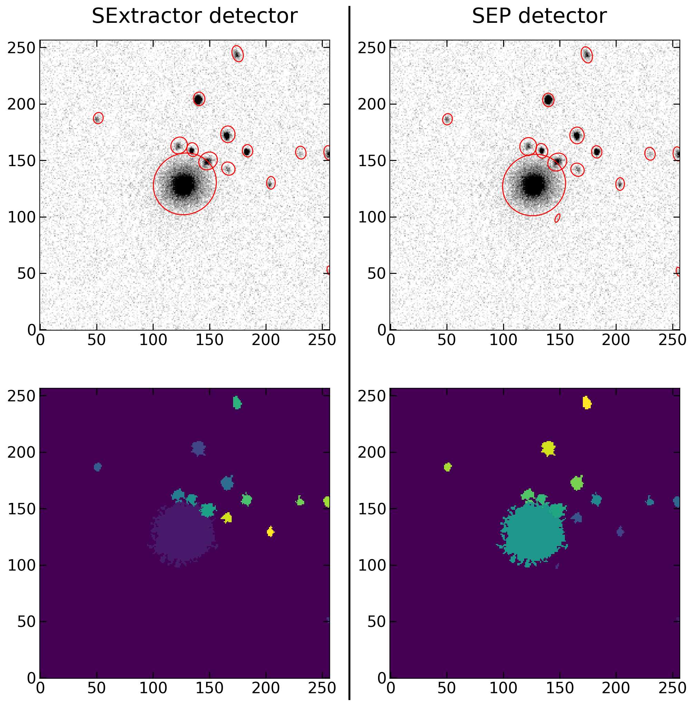

Object Detection
================

There are two main ways to detect objects within this package (at least, for now). First is the commonly used SExtractor. Second is using the SExtractor python alias, SEP. Regarding processing time, the second is faster, due to being already python implemented and not involving reading, write, os operations. Therefore, if you feel that SEP is doing a good job, would recommend using it.

Import Detector Class
---------------------

Just like the background estimator class, the detector receives the object identification (galaxy_name) and the image. The following example is permissive with the detection threshold, in order to guarantee that no galaxy pixel is lost in the segmentation map, which can be relevant to the final segmentation map

.. code-block:: python

   from mex.Detection_module import ObjectDetector
           

SExtractor detection
--------------------
Running SExtractor for a large dataset can be though sometimes. The automated SExtractor runner in the code can be easily called via Python. Also, it can be included in for loops effortlessly. A caveat, however, is that all sextractor-related files (.sex, .param, .conv, etc...) are assumed to be within the same folder (sex_folder) as the default file (default.sex). If need to use files from different folders, please change directly in the default.sex file. Furthermore, to iteratively provide sextractor keywords, it is possible to provide the "sex_keywords" variable, which must a be dictionary with the variable name (exactly like in the SExtractor default.sex file) and the desired value. See below for an example of sex_keywords and function call. Since I also include the "SEP" option, the output catalog is normalized to have similar columns in both cases (x, y, a, b, theta).

.. code-block:: python

   detector = ObjectDetector(galaxy_name, galaxy_image) ## Here I'm using the non-background subtraction just to highlight that the Sextractor itself makes a bkg removal (but it can be turned off in default.sex)
   
   sex_keywords = {"DETECT_MINAREA": 10,
                   "DETECT_THRESH": 1,
                   "VERBOSE_TYPE": "QUIET"}
   sex_catalog, sex_segmentation = detector.sex_detector(sex_folder = './sextractor_files/', 
                                                         sex_default = 'default.sex', 
                                                         sex_keywords = sex_keywords, 
                                                         sex_output_folder = './', clean_up = True)

SEP detection
-------------

Similar to background estimation, a built in function to detect objects using SEP.extract function is included. More details available in https://sep.readthedocs.io/en/v1.0.x/api/sep.extract.html. Also, the sep.extract expects an image with background already subtracted (which is not the case for SExtractor). If sub_bkg = False, it means that the image provided in "ObjectDetector" is already background subtracted. If set to True, it will subtract the background within the function, i.e. the image provided is not background subtracted. By definition (hard coded) it will also generate a segmentation map, similar to SExtractor.

.. code-block:: python

   detector = ObjectDetector(galaxy_name, galaxy_nobkg_sep) # here I'm using sep bkg subtracted image for consistency
   sep_catalog, sep_segmentation = detector.sep_detector(thresh = 1, minarea = 10, deblend_nthresh = 32, 
                                                         deblend_cont = 0.005, filter_type = 'matched',
                                                         bkg_std = bkg_std_frame, sub_bkg = False)

Results comparison
------------------
A comparison between detected object and segmentation map for sextractor and SEP is shown below.

.. code-block:: python

   from matplotlib.patches import Ellipse
   from matplotlib.lines import Line2D
   fig = plt.figure(figsize = (12,12), dpi = 200)
   
   plt.suptitle("SExtractor detector                          SEP detector", fontsize = 22, y = 0.92)
   
   ax = plt.subplot(2,2,1)
   #plt.title('objects properties', fontsize = 22)
   m, s = np.nanmedian(galaxy_nobkg_frame), np.nanstd(galaxy_nobkg_frame)
   plt.imshow(galaxy_nobkg_frame, origin = 'lower', vmin = m, vmax = m+(3*s), cmap = 'gray_r')
   for i in range(len(sex_catalog)):
       e = Ellipse(xy=(sex_catalog['x'][i], sex_catalog['y'][i]),
                   width=6*sex_catalog['a'][i],
                   height=6*sex_catalog['b'][i],
                   angle=sex_catalog['theta'][i] * 180. / np.pi)
       e.set_facecolor('none')
       e.set_edgecolor('red')
       ax.add_artist(e)
   
   
   
   plt.xticks(fontsize = 16)
   plt.yticks(fontsize = 16)
   plt.tick_params(direction = 'in', size = 7, left = True, right = True, bottom = True, top = True, 
                   color = 'k', width = 1)
   
   
   ax = plt.subplot(2,2,2)
   m, s = np.nanmedian(galaxy_nobkg_frame), np.nanstd(galaxy_nobkg_frame)
   plt.imshow(galaxy_nobkg_frame, origin = 'lower', vmin = m, vmax = m+(3*s), cmap = 'gray_r')
   for i in range(len(sep_catalog)):
       e = Ellipse(xy=(sep_catalog['x'][i], sep_catalog['y'][i]),
                   width=6*sep_catalog['a'][i],
                   height=6*sep_catalog['b'][i],
                   angle=sep_catalog['theta'][i] * 180. / np.pi)
       e.set_facecolor('none')
       e.set_edgecolor('red')
       ax.add_artist(e)
   
   
   
   plt.xticks(fontsize = 16)
   plt.yticks(fontsize = 16)
   plt.tick_params(direction = 'in', size = 7, left = True, right = True, bottom = True, top = True, 
                   color = 'k', width = 1)
   
   
   plt.subplot(2,2,3)
   plt.imshow(sex_segmentation, origin = 'lower', cmap = 'viridis')
   plt.xticks(fontsize = 16)
   plt.yticks(fontsize = 16)
   plt.tick_params(direction = 'in', size = 7, left = True, right = True, bottom = True, top = True, 
                   color = 'k', width = 1)
   
   plt.subplot(2,2,4)
   plt.imshow(sep_segmentation, origin = 'lower', cmap = 'viridis')
   plt.xticks(fontsize = 16)
   plt.yticks(fontsize = 16)
   plt.tick_params(direction = 'in', size = 7, left = True, right = True, bottom = True, top = True, 
                   color = 'k', width = 1)
   
   fig.add_artist(Line2D([0.5, 0.5], [0.085, 0.92], color='black', lw=2, transform=fig.transFigure))

   Comparison between detected objects properties (top row) and segmetation mask (bottom row) generated by SExtractor (left) and SEP (right).

