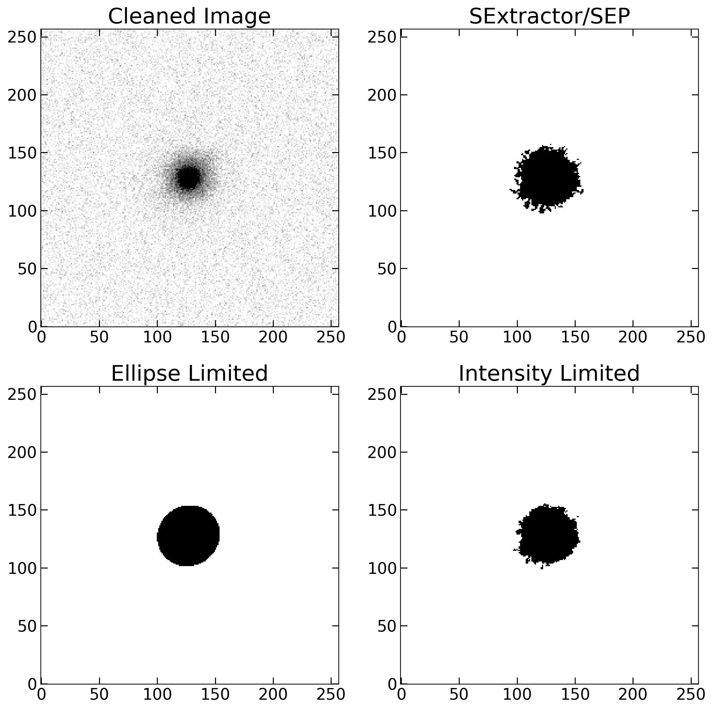

Segmentation Mask
=================

Defining what pixels belong to a given galaxy can directly influence the non-parametric index estimate. Therefore, extra caution is needed in this step, in order to guarantee robust and consistent metrics measurements. For instance, using the sextractor/sep segmentation mask can be extremely influenced by the galaxy redshift, therefore not sampling the same "amount" of the galaxy for different redshifts. Similar to the Petrosian radius calculator, the segmentation relies on more than simply the image and segmentation mask. The inclusion of a characteristic radius (rp, in this case), the x and y positions, and the ellipse defining parameters (a, b, theta) is done to ensure a smoother run in the wrapper code (see pdf manual).

.. code-block:: python

   from galmex.Segmentation_module import SegmentImage
   segm = SegmentImage(galaxy_clean_iso, sep_segmentation, rp, x, y, a, b, theta)

Segmentation from SEP/SExtractor
--------------------------------

The simplest, although highly not recommended, way to define the segmentation mask is to use the output of the SEP/SExtractor. I therefore include a function to simply remove other objects and assign the value "1" to the "main" object.

.. code-block:: python

   segmentation_original = segm._get_original()

Limiting to an ellipse with characteristic radius
-------------------------------------------------
A robust, and simple, way to define pixels belonging to the galaxy is to use all the pixels within an ellipse with the semi-major axis equals to a characteristic radius, while keeping the same a/b ratio and inclination angle. In the example below, I'm using a factor (k_segmentation) times the petrosian radius.

.. code-block:: python

   segmentation_ellipse = segm._limit_to_ellipse(k_segmentation = 1)

Limiting to the average intensity at a given radius
---------------------------------------------------
A more refined, perhaps concise, of defining which pixels belong to the galaxy consists in, instead of limiting to a given radius, limiting to a given intensity/flux. For instance, A proper way to define the threshold intensity/flux is to get the average flux at a given radius. Again, the k_segmentation parameter is a factor that multiplies rp to get the average intensity at k_segmentation times rp, i.e. <I(k_segmentation * rp)>. To avoid including disperse pixels that lie above the threshold, I only perform the selection criteria in pixels attributed to the main object in the SEP/SExtractor segmentation mask. Thus, if the segmented mask when limiting to the average density at a given radius is more permissive than the criteria adopted in SEP/SExtractor for object detection, then the result may be the SEP/SExtractor mask itself.

.. code-block:: python

   segmentation_intensity, mup = segm._limit_to_intensity(k_segmentation = 1)

Segmentation mask comparison
----------------------------

.. code-block:: python

   plt.figure(figsize  = (12,12), dpi = 200)

   plt.subplot(2,2,1)
   plt.title('Cleaned Image', fontsize = 22)
   plt.imshow(galaxy_clean_iso, origin = 'lower', vmin = m, vmax = m+(3*s), cmap = 'gray_r')
   plt.xticks(fontsize = 16)
   plt.yticks(fontsize = 16)
   plt.tick_params(direction = 'in', size = 7, left = True, right = True, bottom = True, top = True, 
                   color = 'k', width = 1)

   plt.subplot(2,2,2)
   plt.title('SExtractor/SEP', fontsize = 22)
   plt.imshow(segmentation_original, origin = 'lower', vmax = 1, vmin = 0, cmap = 'gray_r')
   plt.xticks(fontsize = 16)
   plt.yticks(fontsize = 16)
   plt.tick_params(direction = 'in', size = 7, left = True, right = True, bottom = True, top = True, 
                   color = 'k', width = 1)

   plt.subplot(2,2,3)
   plt.title('Ellipse Limited', fontsize = 22)
   plt.imshow(segmentation_ellipse, origin = 'lower', vmax = 1, vmin = 0, cmap = 'gray_r')
   plt.xticks(fontsize = 16)
   plt.yticks(fontsize = 16)
   plt.tick_params(direction = 'in', size = 7, left = True, right = True, bottom = True, top = True, 
                   color = 'k', width = 1)

   plt.subplot(2,2,4)
   plt.title('Intensity Limited', fontsize = 22)
   plt.imshow(segmentation_intensity, origin = 'lower', vmax = 1, vmin = 0, cmap = 'gray_r')
   plt.xticks(fontsize = 16)
   plt.yticks(fontsize = 16)
   plt.tick_params(direction = 'in', size = 7, left = True, right = True, bottom = True, top = True, 
                   color = 'k', width = 1)

   Comparison between different segmentation methods: original SExtractor/SEP mask, elliptical limit, and intensity-based mask.
