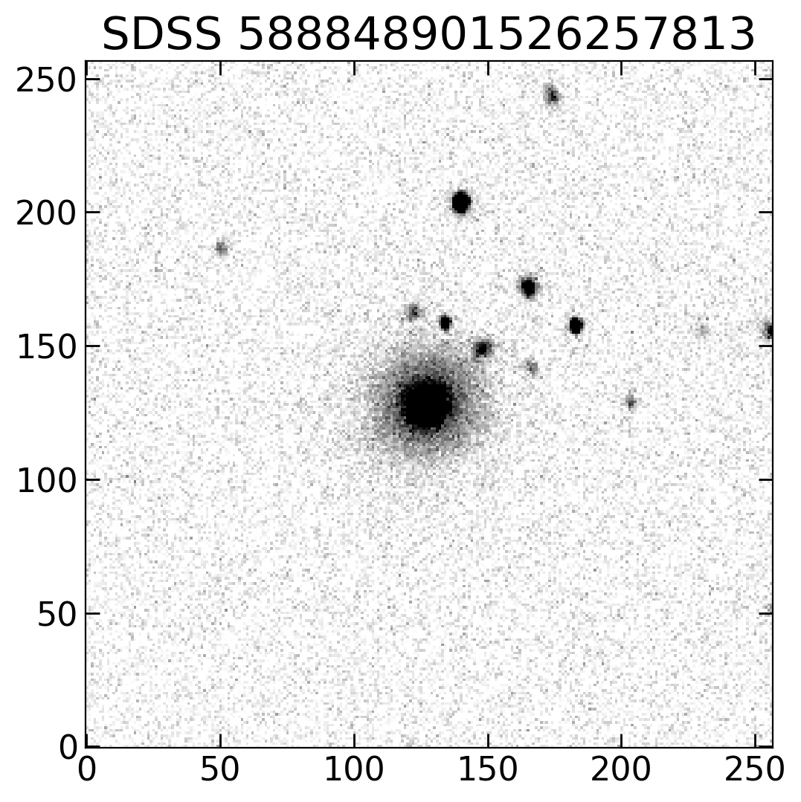

Functions Description & Examples
================================

This section provides a practical guide to the functions available in the Morphology Extractor (MEx) toolkit, organized by the main components of the morphological analysis pipeline. Each subsection corresponds to a specific processing step or metric calculation, with code examples and configuration tips. Througout this description, the following galaxy (objID = 588848901526257813 in SDSS-DR7) will be used as example.

   Cutout of galaxy SDSS 588848901526257813 (DR7) in r-band, that is used hereafter in this tutorial.

.. toctree::
   :maxdepth: 1
   :caption: Contents:

   Background_Subtraction
   Object_Detection
   Image_Cleaning
   Light_Profile_Analysis
   Segmentation_Mask
   CAS_metrics
   MEGG_metrics

